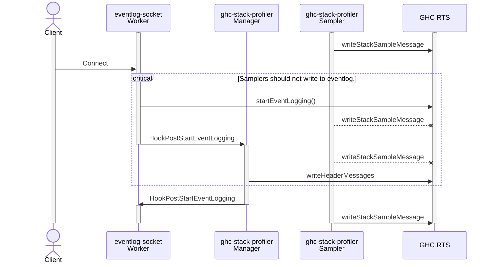
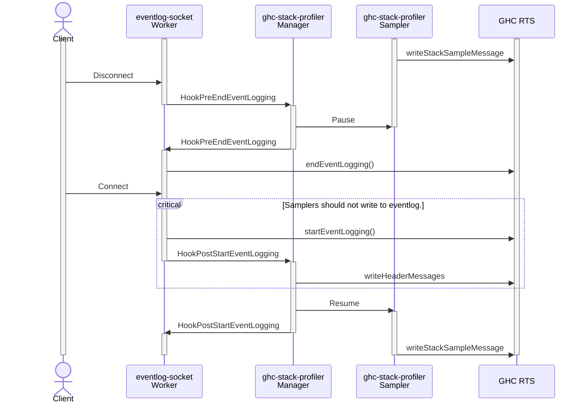
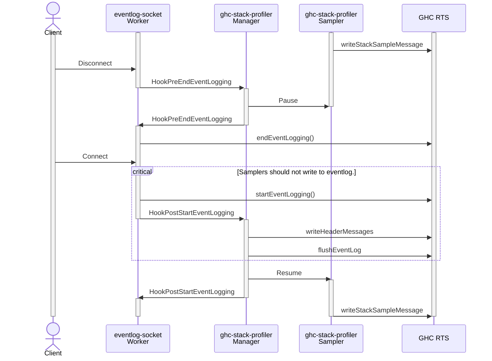

# Guide for Plugin Developers

This is a guide for developers who work on plugins that communicate over the eventlog and register custom control commands.

## Using the `eventlog-socket` lifecycle hooks

The `eventlog-socket` lifecycle events are intended to be used by packages that communicate over the eventlog to enable them to respond to new connections. Let's look at the `ghc-stack-profiler` package, which writes stack profiles to the eventlog. Its communication protocol has _header messages_ and _stack sample messages_. The header messages define variables which can be reused in later stack sample messages. This is used to avoid, e.g., sending the same annotation or source location string over and over. However, when a new client connects, it won't have seen any previous communication, and won't be able to resolve any previously defined variable. This is the motivation for lifecycle events. Whenever a new client connects, `eventlog-socket` calls the `ghc-stack-profiler`'s handler for the `HookPostStartEventLogging` hook, which reposts all header messages. The invariant that `ghc-stack-profiler` needs to ensure for correctness is that all previous header messages are _flushed_ to the eventlog writer _before_ any new stack sample messages are written.

There are some important considerations when using lifecycle events:

- If there is an internal race between `ghc-stack-profiler` reposting its header messages and posting new stack sample messages, then it's still possible for the client to receive a stack sample message using some variable _before_ the header message that defines it.

- If there is a race between starting `eventlog-socket` and `ghc-stack-profiler` registering its lifecycle handlers, then some lifecycle events may be missed, and it's possible that a client doesn't receive the header messages _at all_.

This document contains a detailed discussion of the `eventlog-socket` lifecycle events and their use in packages that are intended to communicate over the eventlog, using `ghc-stack-profiler` as an example.

### The `eventlog-socket` lifecycle hooks

The `eventlog-socket` defines two lifecycle hooks.

#### The `HookPostStartEventLogging` hook

The `HookPostStartEventLogging` handlers are called whenever `startEventLogging` is called with `eventlog-socket`'s writer.

- If `eventlog-socket` is started from a Haskell main, it calls both `startEventLogging` and the `HookPostStartEventLogging` handlers every time a new client connects.

- If `eventlog-socket` is started from a C main and `eventlog-socket`'s writer is passed in the `RtsConfig`, the first connection is treated differently from subsequent connections.
  - On RTS initialisation, the RTS calls `startEventLogging` and attaches `eventlog-socket`'s writer. When `eventlog_socket_wrap_hs_main` or `eventlog_socket_signal_ghc_rts_ready` are first called, `eventlog-socket` calls the `HookPostStartEventLogging` handlers, to signal that the RTS called `startEventLogging`. This should occur _before_ the Haskell main is evaluated.
  - On the first connection, `eventlog-socket` skips `startEventLogging` and the `HookPostStartEventLogging` handlers on the first connection. This is to preserve any events that were logged between RTS initialisation and the first connection.
  - On subsequent connections, `eventlog-socket` acts as usual, and calls both `startEventLogging` and the `HookPostStartEventLogging` handlers.

> [!WARNING]
> These guarantees only apply when `eventlog-socket` and the GHC RTS are the only users of the `startEventLogging` and `endEventLogging` functions. If any other code uses these functions, this leads to undefined behaviour.

> [!WARNING]
> Strictly speaking, the `HookPostStartEventLogging` hook _does not_ correspond to a new connection. It corresponds to starting or restarting a new eventlog. This _almost always_ corresponds to a new connection, with the exception of the first connection when instrumented from a C main, as described above. In this scenario, if no client ever connects, the `HookPostStartEventLogging` handlers will still be called once.

#### The `HookPreEndEventLogging` hook

The `HookPreEndEventLogging` handlers are called whenever `endEventLogging` is called while `eventlog-socket`'s writer is attached.

> [!WARNING]
> These guarantees only apply when `eventlog-socket` and the GHC RTS are the only users of the `startEventLogging` and `endEventLogging` functions. If any other code uses these functions, this leads to undefined behaviour.

### Races between lifecycle hooks and eventlog usage

Any package that uses the `eventlog-socket` lifecycle hooks should be cautious of internal races between the lifecycle hooks and writing to the eventlog.

In the case of `ghc-stack-profiler`, there could be an internal race between its `HookPostStartEventLogging` handler reposting the header messages and its sampler threads posting new stack sample messages. If this is the case, then it's still possible for the client to receive a stack sample message using some variable _before_ the header message that defines it.

The call to `startEventLogging()` clears the eventlog buffers and the call to `writeHeaderMessages` writes the header messages to the eventlog. If any call to `writeStackSampleMessage` occurs in this critical section, this could corrupt `ghc-stack-profiler`'s eventlog output, emitting a stack sample message before the header messages.

To guard the critical section, `ghc-stack-profiler` can pause sampler threads in its `HookPreEndEventLogging` handler and resume them in its `HookPostStartEventLogging` handler.

Unfortunately, this is not the complete picture. In the RTS, events are written to buffers corresponding to the RTS capabilities. There is one buffer for each capability and one global buffer. The `writeHeaderMessages` and `writeStackSampleMessage` functions write their messages to the eventlog using the `traceUserBinaryMsg` primitive, which writes the message to whichever buffer corresponds to the capability that calls it. These per-capability buffers are flushed to `eventlog-socket`'s writer whenever they fill up or whenever the eventlog flush interval is reached, if set. This can lead to reordering, even if all the header messages are written before all stack sample messages:

- The buffer that contains the stack sample messages may fill up and flush before the buffer that contains the header messages.
- The eventlog buffers are flushed in order, which means that when the eventlog flush interval is is reached, the buffer that contains the stack sample messages may be sorted before the buffer that contains the header messages, and flush first.

There are two ways that `ghc-stack-profiler` can guard against reordering in the buffers:

1. It could use `forkOn` to ensure that all its messages are written from the same capability. This would cause all messages to be written into the same buffer and preserve their order. The drawback of this approach is that it limits the potential for parallel sampler threads.

2. It could use `flushEventLog` to explicitly flush the header messages. The drawback of this approach is that `flushEventLog` requires an application-wide synchronisation.

   In older GHC versions, there are some caveats using `flushEventLog` concurrently with `startEventLogging` and `endEventLogging`, but this should not occur when used in `eventlog-socket`'s `HookPostStartEventLogging` handlers.

In our opinion, the best option is to explicitly call `flushEventLog`, assuming that new connections are infrequent. Let's add it to our sequence diagram.

### Races between lifecycle events and handler registration

Any package that uses the `eventlog-socket` lifecycle hooks should be cautious of races between the lifecycle hooks and and lifecycle hook registration. Moreover, any such package should caution its users to be wary of such races as well.

If lifecycle handlers are registered _after_ `eventlog-socket` is started, whether or not the lifecycle handlers are called is undefined. This is easily solved by ensuring that all handler registration has finished before `eventlog-socket` is started. Package authors should caution their users and explain the correct order of initialisation functions.

If `eventlog-socket` is started from a C main and `eventlog-socket`'s writer is passed in the `RtsConfig`, the package must register its lifecycle handlers from the C main and must be prepared for those lifecycle handlers to be called _before_ the Haskell main is evaluated.

> [!WARNING]
> If `eventlog-socket` and the package are both initialised in a C main, then the package will receive a post-RTS initialisation call to its `HookPostStartEventLogging` handler. If the package uses these handlers to repost some events, it should _not_ repost those events in response to that post-RTS initialisation call, as this will cause them to be posted _twice_, once when they were first posted and once when the handler is called.
>
> This warning is pertinent to packages that post events on initialisation. In the case of `ghc-stack-profiler`, it _should not_ repost its header messages in response to the post-RTS initialisation call to its `HookPostStartEventLogging` handler, but there are unlikely to be any such events, as the call happens _before_ the Haskell main is evaluated.

> [!NOTE]
> The lifecycle handlers are guaranteed to only be called _after_ the RTS is initialised.

> [!WARNING]
> If `eventlog-socket` is started from a C main and `eventlog-socket`'s writer is passed in the `RtsConfig`, but the package registers its lifecycle handlers in the Haskell main, then the post-RTS initialisation call to `HookPostStartEventLogging` is guaranteed to be missed. Moreover, if several connections occur _before_ the lifecycle handlers are registered, then the corresponding calls to `HookPostStartEventLogging` and `HookPreEndEventLogging` are also missed.
> If the package's communication protocol relies on any kind of header then it _should not_ post any events and ignore any call to its `HookPreEndEventLogging` _before_ the first call to its `HookPostStartEventLogging` handler.
>
> In the case of `ghc-stack-profiler`, this means that it _should not_ start its stack sampling threads until the first call to its `HookPostStartEventLogging` handler.

> [!NOTE]
> This could be fixed in `eventlog-socket` by adding an option where `eventlog-socket` attaches `eventlog-socket`'s writer, but waits to open the eventlog socket until the function `signalReady` is called from Haskell.
